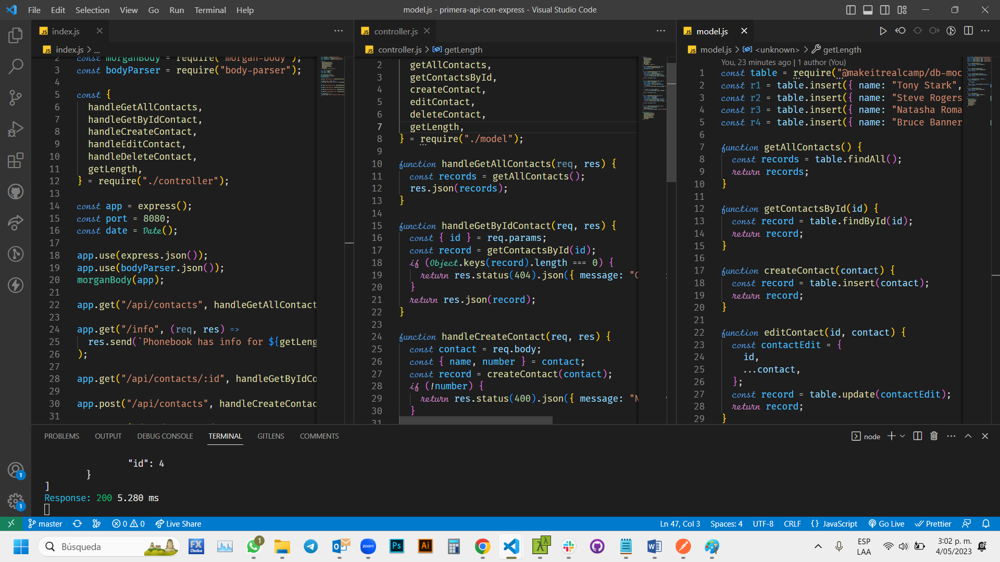

# Make It Real - My first Express API
## This is a solution to the *Express API* project of the Make It Real course.

## The challenge
Create an API using Express

## Screenshot

## My process
### Built with
- Semantic markup using vscode editor
- Express NodeJs using vs code
- Postman
- Chrome Browser

## What I learned
I learn and practice how to create an API using Express NodeJs and models

## Author
Juan David Peña  
github - @juandape  
email - juandavidp76@hotmail.com  

## Acknowledgments
Thanks to Make it Real to show me a path to become a better programmer